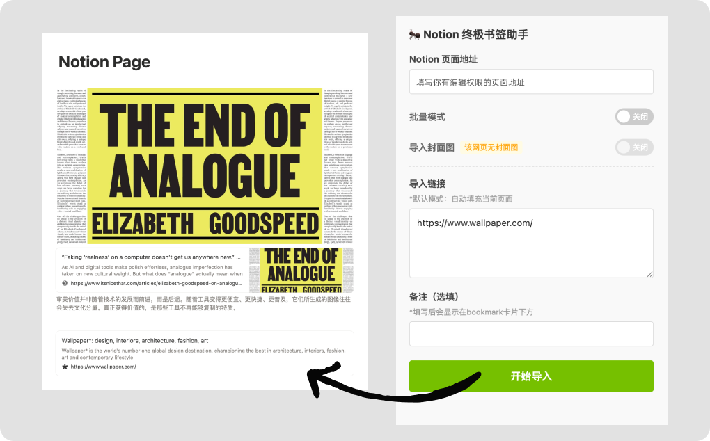

## Notion 终极书签助手 (Notion Ultimate Bookmark)

> 这是一个 Chrome 本地插件，用于解决 Notion 官方书签抓取不全的问题。
> 它能绕过反爬虫限制，自动获取网页信息，并以完美的 Notion Bookmark 样式存入。

### 📦 安装步骤 (Installation)

1.  下载并解压本压缩包。
2.  打开 Chrome 浏览器，访问地址：`chrome://extensions/`。
3.  打开右上角的 **"开发者模式" (Developer mode)** 开关。
4.  点击左上角的 **"加载已解压的扩展程序"**。
5.  选择解压后的文件夹中的 `src` 目录。

### 🚀 快速开始 (Quick Start)

1.  **准备：** 确保您已在 Chrome 中登录 [www.notion.so](https://www.notion.so)。
2.  **配置：** 点击插件图标，填入您想要存入书签的 **Notion Page ID**。
    * *推荐获取方式：Notion 页面右上角 Share -> Copy link，直接粘贴链接即可，插件会自动提取 ID。*
3.  **使用：**
    *   **默认模式（单页）：** 打开插件，Notion 地址会自动填充。点击“开始导入”即可。
    *   **批量模式（多页）：** 开启“批量模式”开关。
        *   可以使用“⚡ 填充链接”按钮添加当前页，或手动粘贴多个链接（一行一个）。
        *   支持“草稿箱”功能：未导入的链接会自动保存，切换网页不会丢失。
        *   导入过程中，已成功的链接会自动从列表中移除。
  
---
附录：维护与高级指南
以下内容供开发者或遇到问题时参考。
  
一、 风险评估 (Risk Assessment)
1. 隐私泄露风险：0% (安全)
* 这是一个本地插件，代码完全运行在您的电脑上，没有后台服务器，不上传数据。
* 插件权限仅限访问 `notion.so` 和您当前正在处理的网页。
  
2. 账号安全风险：<1% (极低)
* 插件使用 Notion 私有接口模拟用户点击。代码内置了请求延迟，只要不进行恶意高频攻击，正常使用不会导致封号。
  
3. 功能失效风险：20% (中等)
* 如果 Notion 系统进行底层重构（修改接口名称），插件可能会报错。此时需要更新 `popup.js` 中的 API 地址。

二、 常见故障与修复 (Troubleshooting)
1. 报错 "登录失效" / "权限不足"
* 原因：浏览器中的 Notion 登录状态过期，或切换到了错误的工作区。
* 解决：新开标签页访问 `www.notion.so`，确保能看到自己的笔记，然后重试。
  
2. 报错 "数据异常" / "找不到 ID"
* 原因：填写的 ID 不正确，或者填写的是 Database 的“视图 ID”。
* 解决：请使用 Share -> Copy link 的方式获取链接，并重新粘贴。
  
3. 报错 "saveTransactions failed" (插件完全坏了)
* 原因：Notion 官方更新了接口。
* 解决：需要联系插件维护者，通过 Chrome 开发者工具抓包查看新的接口名称，并更新代码。
  
三、 效率提升：快捷键设置
告别鼠标点击，实现键盘流操作：
1. 在浏览器地址栏输入：`chrome://extensions/shortcuts`
2. 找到 Notion 终极书签助手。
3. 点击“输入快捷键”旁的笔图标。
4. 按下组合键（推荐 `Alt + N` 或 `Ctrl + Shift + F`）。
5. 使用：浏览网页时 -> 按快捷键 -> 回车 -> 完成。
