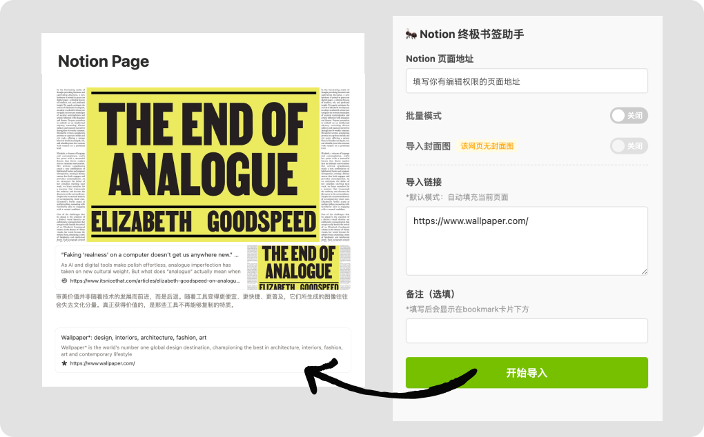

# Notion 导入助手 (Notion Import Assistant)

> 这是一个 Chrome 本地插件，用于解决 Notion 官方 Web Clipper 抓取不全的问题。
> 它能绕过反爬虫限制，自动获取网页信息，并以结构化、完美的格式存入您的 Notion。

当前版本：**v5.0.0**

## 📦 安装步骤 (Installation)

1.  下载并解压本压缩包。
2.  打开 Chrome 浏览器，访问地址：`chrome://extensions/`
3.  打开右上角的 **"开发者模式" (Developer mode)** 开关。
4.  点击左上角的 **"加载已解压的扩展程序"**。
5.  选择解压后的文件夹中的 `src` 目录。
6.  *如果升级版本，请在 `chrome://extensions/` 页面点击该插件此处的“刷新”圆圈按钮（Reload）。*

## 🚀 核心功能与使用 (Features & Usage)

1.  **准备：** 确保您已在 Chrome 中登录 [www.notion.so](https://www.notion.so)。
2.  **配置：** 点击插件图标，填入您想要存入的 **Notion Page ID**（目标页面或 Database 均可）。
    * *推荐获取方式：Notion 页面右上角 Share -> Copy link，直接粘贴链接即可，插件会自动提取 ID。*

### 🏷️ 导入样式选择 (Import Styles)
版本 5.0.0 起，工具提供了三种针对性的内容抓取及展示模式：

*   **🔖 书签模式（单页）：** 
    *   **适用场景：** 想要将当前网页作为带预览的 Bookmark 卡片存入 Notion。
    *   **特性：** 自动提取网页链接，也可在“备注（选填）”框中书写内容（该内容将展示在书签卡片下方）。
    *   **封面图获取：** 开启开关后，会连同网页自身的 Open Graph 大图一起抓取，带来极佳的全幅视觉效果。

*   **🐦 推特长文模式：** 
    *   **适用场景：** 一键保存并结构化重排整条 X/Twitter 长推文（Thread）。
    *   **特性：** 在此模式下点击导入，助手会自动将作者、日期、推文文字及长文分段等解析排版，直接转存为 Notion 阅读笔记。
    *   **智能分配：** 如果您的目标是一个普通的 Notion Page，信息会精美地排版在顶部导语；如果您的目标是 Database，它会自动新建对应名为 `Author`、`Date`、`Tags`、`URL` 的属性并填入数据。
    *   *注：安全限制保护，一旦浏览的不是推特（*.x.com / twitter.com），此模式按键将被智能禁止。*

*   **⚡ 批量链接模式（多页）：** 
    *   **适用场景：** 处理手头的一大把 URL 列表。
    *   **特性：** 你可以在大文本框中直接批量粘贴（一行一个）准备入库的网址集合；或者不断点击“填充链接”将您正在看的网页加入暂存队列。
    *   **智能持久化：** 即便你填写到一半切换网页，草稿和参数也永不丢失。导入过程会随着每一次成功响应从列表中逐步销毁对应链接。

---

## ⚙️ 附录：维护与高级指南
以下内容供开发者或遇到问题时参考。

### 一、 风险评估 (Risk Assessment)
1. **隐私泄露风险：0% (安全)**
* 这是一个本地插件，代码完全运行在您的电脑上，没有后台服务器，绝不上传数据。
* 插件权限仅限访问 `notion.so` 和您当前正在处理的网页。
  
2. **账号安全风险：<1% (极低)**
* 插件使用 Notion 私有接口模拟用户日常点击操作以及合理的请求延迟排队。只要不超高频请求刷量，正常使用不存在封号危机。
  
3. **API 失效风险：可能存在**
* 该工具深度依赖 Notion 的未公开/内部 v3 API（比如 `saveTransactions`）。一旦 Notion 后台改变表结构或 API 名称，插件也许会抛出错误并停止工作。这时需在 `popup.js` 重新抓包修复更新。

### 二、 常见故障与修复 (Troubleshooting)
1. **无法抓取：提示 "请先登录 www.notion.so"**
* 原因：新授权或系统清理过 cookie 导致 Notion 的身份凭证会话已失效。
* 解决：新开标签页访问 `www.notion.so`，确认您的左侧边栏出现内容后再重试即可。
  
2. **连接异常：报错 "数据异常"**
* 原因：填写的地址格式无法被提取。
* 解决：使用 Notion 的顶级“复制链接（Copy Link）”直接粘贴长链接，切勿通过剪切 URL 栏或输入错误视图 ID。
  
### 三、 极致极客：快捷键设置
为您打造的极致键盘流！
1. 在浏览器地址栏输入：`chrome://extensions/shortcuts`
2. 找到 **Notion 导入助手**。
3. 点击“输入快捷键”旁的笔图标。
4. 按下组合键（推荐设置为 `Alt + N` 或 `Mac: Option + N`）。
5. 浏览中按下组合键，回车直接快速入库。
