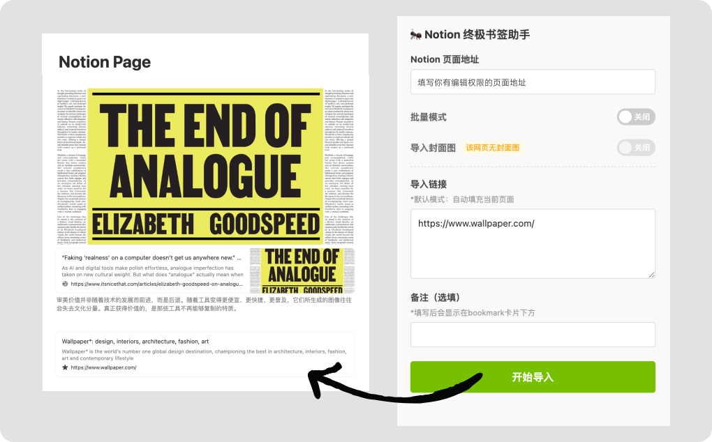

# Notion 导入助手 (Notion Import Assistant)

> 这是一个 Chrome 本地插件，用于解决 Notion 官方 Web Clipper 抓取不全的问题。
> 它能绕过反爬虫限制，自动获取网页信息，并以结构化、完美的格式存入您的 Notion。

## 📦 安装步骤 (Installation)

1.  下载并解压本压缩包。
2.  打开 Chrome 浏览器，访问地址：`chrome://extensions/`
3.  打开右上角的 **"开发者模式" (Developer mode)** 开关。
4.  点击左上角的 **"加载已解压的扩展程序"**。
5.  选择解压后的文件夹中的 `src` 目录。
6.  *如果升级版本，请在 `chrome://extensions/` 页面点击该插件此处的“刷新”圆圈按钮（Reload）。*

## 🚀 核心功能与使用 (Features & Usage)

1.  **准备：** 确保您已在 Chrome 中登录 [Notion](https://www.notion.so)。
2.  **配置：** 点击插件图标，填入您想要存入的 **Notion Page ID**（目标页面或 Database 均可）。
    * *推荐获取方式：Notion 页面右上角 Share -> Copy link，直接粘贴链接即可，插件会自动提取 ID。*

### 🏷️ 导入样式选择 (Import Styles)
工具提供三种模式：

*   **🔖 书签模式：** 
    *   将网页保存为 Notion Bookmark 卡片。
    *   支持备注、封面图和批量 URL（一行一个）。

*   **📄 文章模式：** 
    *   提取当前网页正文，保存为可读的 Notion 页面或 Database 条目。
    *   支持先框选正文再导入；对微信公众号文章做了专项适配。

*   **🐦 推特（X）长文模式：** 
    *   保存 X/Twitter 推文串或 X Article 长文。
    *   目标是普通 Page 时会新建子页面；目标是 Database 时会新建一条记录。
    *   支持作者、日期、正文、图片、代码块等结构化导入；非 X/Twitter 页面会自动禁用。

---

## ⚙️ 附录：维护与高级指南
以下内容供开发者或遇到问题时参考。

### 一、 风险评估 (Risk Assessment)
1. **隐私说明**
* 这是一个本地插件，代码完全运行在您的电脑上，没有后台服务器，绝不上传数据。
* 插件使用网页访问权限抓取当前页面与用户输入链接的元数据，并使用 Notion 域名权限完成导入。
  
2. **账号安全风险：<1% (极低)**
* 插件使用 Notion 私有接口模拟用户日常点击操作以及合理的请求延迟排队。只要不超高频请求刷量，正常使用不存在封号危机。
  
3. **API 失效风险：可能存在**
* 该工具深度依赖 Notion 的未公开/内部 v3 API（比如 `saveTransactions`）。一旦 Notion 后台改变表结构或 API 名称，插件也许会抛出错误并停止工作。这时需检查 `popup/notion/` 下的请求与写入模块。

### 二、 常见故障与修复 (Troubleshooting)
1. **无法抓取：提示 "请先登录 Notion"**
* 原因：新授权或系统清理过 cookie 导致 Notion 的身份凭证会话已失效。
* 解决：新开标签页访问 `www.notion.so` 或 `app.notion.com`，确认您的左侧边栏出现内容后再重试即可。
  
2. **连接异常：报错 "数据异常"**
* 原因：填写的地址格式无法被提取。
* 解决：使用 Notion 的顶级“复制链接（Copy Link）”直接粘贴长链接，切勿通过剪切 URL 栏或输入错误视图 ID。
  
### 三、 极致极客：快捷键设置
为您打造的极致键盘流！
1. 在浏览器地址栏输入：`chrome://extensions/shortcuts`
2. 找到 **Notion 导入助手**。
3. 点击“输入快捷键”旁的笔图标。
4. 按下组合键（推荐设置为 `Alt + N` 或 `Mac: Option + N`）。
5. 浏览中按下组合键，回车直接快速入库。
